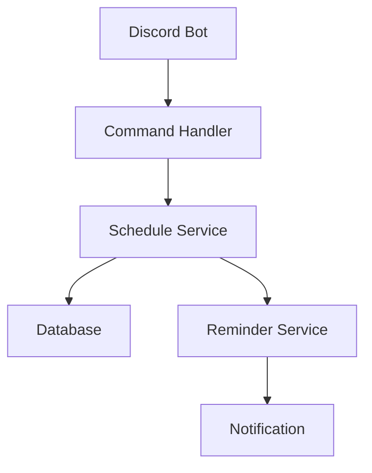
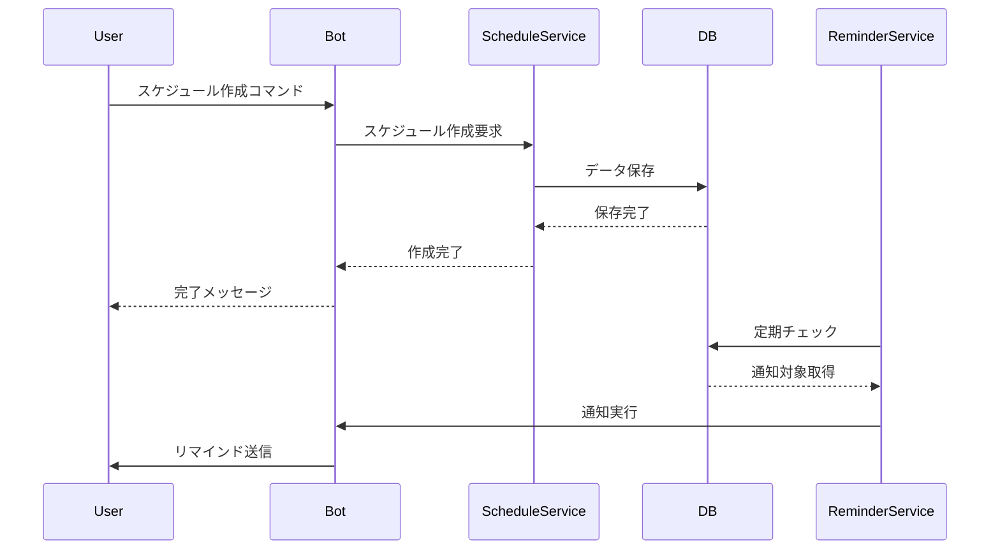

# 設計仕様書

## システム概要

### アーキテクチャ図


### データフロー


## アーキテクチャ設計

### レイヤー構造
1. プレゼンテーション層（Discord Commands）
   - ユーザーインターフェース
   - コマンドハンドリング
   - メッセージフォーマット

2. サービス層（Business Logic）
   - スケジュール管理
   - 投票処理
   - リマインダー管理

3. データアクセス層（Repository）
   - データベース操作
   - クエリ実行
   - トランザクション管理

### コンポーネント設計

#### Command Handler
- スラッシュコマンドの登録と処理
- モーダル・ボタンのインタラクション処理
- エラーハンドリング

#### Schedule Service
- スケジュール作成・取得・更新
- 投票状態の管理
- バリデーション処理

#### Reminder Service
- 定期的なスケジュールチェック
- 通知条件の評価
- メンション送信

#### Database Manager
- コネクション管理
- マイグレーション
- バックアップ

## データベース設計

### テーブル構造

#### schedules
```sql
CREATE TABLE schedules (
    id TEXT PRIMARY KEY,
    title TEXT NOT NULL,
    description TEXT,
    creator_id INTEGER NOT NULL,
    channel_id INTEGER NOT NULL,
    status TEXT NOT NULL,
    created_at TIMESTAMP NOT NULL,
    reminder_sent BOOLEAN DEFAULT FALSE
);
```

#### schedule_dates
```sql
CREATE TABLE schedule_dates (
    id INTEGER PRIMARY KEY AUTOINCREMENT,
    schedule_id TEXT NOT NULL,
    date TIMESTAMP NOT NULL,
    FOREIGN KEY (schedule_id) REFERENCES schedules(id)
);
```

#### votes
```sql
CREATE TABLE votes (
    id INTEGER PRIMARY KEY AUTOINCREMENT,
    schedule_id TEXT NOT NULL,
    user_id INTEGER NOT NULL,
    date TIMESTAMP NOT NULL,
    vote_status TEXT NOT NULL,
    FOREIGN KEY (schedule_id) REFERENCES schedules(id),
    UNIQUE(schedule_id, user_id, date)
);
```

### インデックス設計
```sql
CREATE INDEX idx_schedule_dates_schedule_id ON schedule_dates(schedule_id);
CREATE INDEX idx_votes_schedule_id ON votes(schedule_id);
CREATE INDEX idx_votes_user_id ON votes(user_id);
CREATE INDEX idx_schedules_status ON schedules(status);
```

## セキュリティ設計

### 入力バリデーション
- タイトル: 最大100文字
- 説明: 最大1000文字
- 候補日時: 最大10件
- 過去の日時は指定不可

### 権限管理
- スケジュール作成: 全メンバー可能
- スケジュール削除: 作成者のみ
- 投票: 全メンバー可能
- 設定変更: 管理者のみ

### データ保護
- SQLインジェクション対策
- XSS対策
- レート制限

## パフォーマンス設計

### データベース最適化
- インデックスの適切な設定
- 定期的なVACUUM実行
- 不要データの自動削除

### キャッシング戦略
- スケジュールデータのメモリキャッシュ
- 投票結果の一時キャッシュ
- コマンドクールダウン

## エラーハンドリング

### エラーの種類と対応
1. ユーザー入力エラー
   - バリデーションエラー
   - 権限エラー
   - 不正な操作

2. システムエラー
   - データベースエラー
   - API制限エラー
   - 接続エラー

### リカバリー戦略
- 自動リトライ
- エラーログ記録
- 管理者通知

## 拡張性設計

### プラグインシステム
- カスタムコマンド追加
- 通知方法のカスタマイズ
- 外部サービス連携

### 設定のカスタマイズ
- リマインド間隔
- 投票オプション
- メッセージテンプレート

## 監視設計

### ログ設計
- アクセスログ
- エラーログ
- 操作ログ

### メトリクス収集
- コマンド使用頻度
- エラー発生率
- レスポンス時間

## 運用設計

### バックアップ戦略
- 定期的なデータバックアップ
- 設定ファイルのバックアップ
- リストア手順

### メンテナンス
- 定期的なヘルスチェック
- パフォーマンス分析
- アップデート手順
