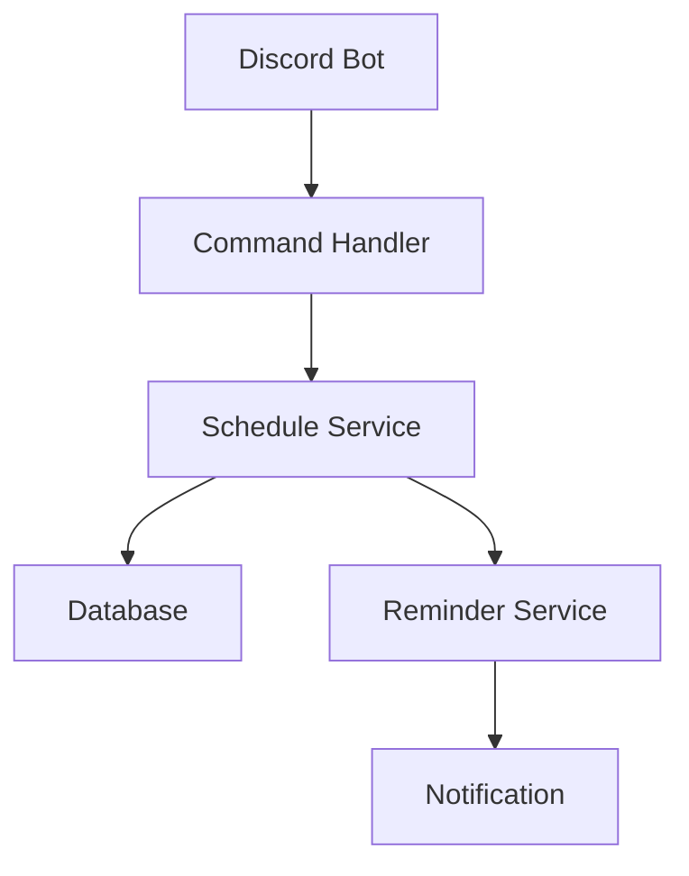
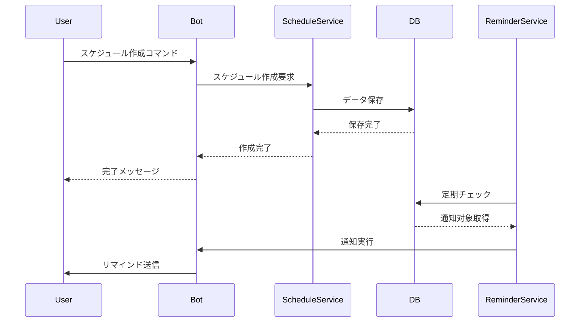

# 設計仕様書

## システム概要

### アーキテクチャ図


### データフロー


## アーキテクチャ設計

### レイヤー構造
1. プレゼンテーション層（Discord Commands）
   - ユーザーインターフェース
   - コマンドハンドリング
   - メッセージフォーマット

2. サービス層（Business Logic）
   - スケジュール管理
   - 投票処理
   - リマインダー管理

3. データアクセス層（Repository）
   - データベース操作
   - クエリ実行
   - トランザクション管理

### コンポーネント設計

#### Database Manager
- シングルトンパターンによるインスタンス管理
- 非同期SQLite接続の提供
- トランザクション制御
- マイグレーション管理

#### Repository
- CRUD操作の実装
- クエリ最適化
- エラーハンドリング
- データ整合性の保証

#### Schedule Service
- スケジュール作成・取得・更新
- 投票状態の管理
- バリデーション処理

#### Reminder Service
- 定期的なスケジュールチェック
- 通知条件の評価
- メンション送信

## データベース設計

### テーブル構造

#### schedules
```sql
CREATE TABLE schedules (
    id TEXT PRIMARY KEY,              -- UUID形式
    title TEXT NOT NULL,              -- イベントタイトル
    description TEXT,                 -- イベントの説明
    creator_id INTEGER NOT NULL,      -- 作成者のDiscord ID
    channel_id INTEGER NOT NULL,      -- 作成されたチャンネルのID
    status TEXT NOT NULL,             -- 'active', 'confirmed', 'cancelled'
    created_at TIMESTAMP NOT NULL,    -- 作成日時
    confirmed_date TIMESTAMP,         -- 確定した日時
    reminder_sent BOOLEAN DEFAULT FALSE -- リマインダー送信済みフラグ
);
```

#### schedule_dates
```sql
CREATE TABLE schedule_dates (
    id INTEGER PRIMARY KEY AUTOINCREMENT,
    schedule_id TEXT NOT NULL,
    date TIMESTAMP NOT NULL,          -- 候補日時
    FOREIGN KEY (schedule_id) REFERENCES schedules(id),
    UNIQUE(schedule_id, date)         -- 同一スケジュール内での日時重複を防ぐ
);
```

#### votes
```sql
CREATE TABLE votes (
    id INTEGER PRIMARY KEY AUTOINCREMENT,
    schedule_id TEXT NOT NULL,
    user_id INTEGER NOT NULL,         -- 投票者のDiscord ID
    date TIMESTAMP NOT NULL,          -- 投票対象の日時
    vote_status TEXT NOT NULL,        -- '⭕', '🔺', '❌'
    created_at TIMESTAMP NOT NULL,    -- 投票日時
    FOREIGN KEY (schedule_id) REFERENCES schedules(id),
    UNIQUE(schedule_id, user_id, date) -- 1ユーザー1候補日につき1票
);
```

### インデックス設計
```sql
CREATE INDEX idx_schedule_dates_schedule_id ON schedule_dates(schedule_id);
CREATE INDEX idx_votes_schedule_id ON votes(schedule_id);
CREATE INDEX idx_votes_user_id ON votes(user_id);
CREATE INDEX idx_schedules_status ON schedules(status);
```

## データアクセスパターン

### 1. トランザクション管理
- コンテキストマネージャーによるトランザクション制御
- 例外発生時の自動ロールバック
- 接続プールの管理

### 2. リポジトリパターン
- モデルとデータベース操作の分離
- 集約の一貫性保証
- ドメインロジックの隠蔽

### 3. クエリ最適化
- インデックスの活用
- 結合クエリの最適化
- N+1問題の回避

## エラーハンドリング

### 1. データベースエラー
- 接続エラー
  - 再試行
  - タイムアウト設定
- 制約違反
  - バリデーション
  - エラーメッセージ

### 2. アプリケーションエラー
- バリデーションエラー
  - 入力値チェック
  - 整合性チェック
- ビジネスロジックエラー
  - 状態遷移チェック
  - 権限チェック

### 3. ロギング
- エラーレベル別ログ
- スタックトレース記録
- 監視メトリクス

## パフォーマンス設計

### 1. データベース最適化
- インデックス活用
- クエリ最適化
- コネクションプール

### 2. メモリ管理
- キャッシュ戦略
- オブジェクトプール
- リソース解放

### 3. 非同期処理
- 非同期IO
- タスクキュー
- バッチ処理

## 運用設計

### バックアップ戦略
- 定期バックアップ
- リストア手順
- データ整合性チェック

### メンテナンス
- 定期的なVACUUM実行
- インデックス再構築
- パフォーマンス監視
