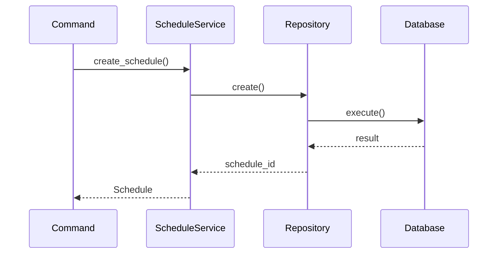
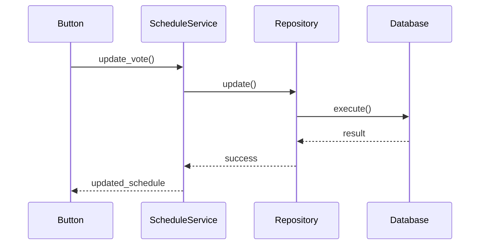
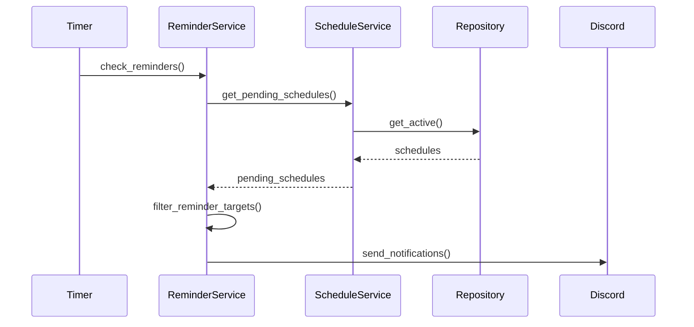
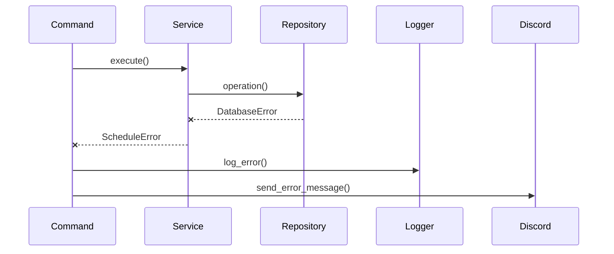

# モジュール設計書

## ディレクトリ構造
```
src/
└── simple_schedule_bot/
    ├── __init__.py
    ├── main.py              # エントリーポイント
    ├── core/               # コア機能
    │   ├── __init__.py
    │   ├── config.py       # 設定管理
    │   ├── logger.py       # ログ管理
    │   └── exceptions.py   # カスタム例外
    │
    ├── models/            # データモデル
    │   ├── __init__.py
    │   └── schedule.py    # スケジュールモデル
    │
    ├── services/          # ビジネスロジック
    │   ├── __init__.py
    │   ├── schedule_service.py  # スケジュール管理
    │   └── reminder_service.py  # リマインダー管理
    │
    └── db/               # データベース関連
        ├── __init__.py
        ├── database.py   # DB管理
        └── repository.py # データアクセス
```

## モジュール詳細

### 1. Core Module

#### config.py
```python
class Config:
    """環境変数と設定の管理"""
    DISCORD_TOKEN: str
    COMMAND_PREFIX: str = "/"
    DB_PATH: str = "data/schedule.db"
    MAX_DATES: int = 10
    REMINDER_CHECK_INTERVAL: int = 60  # seconds
```

#### logger.py
```python
class Logger:
    """ログ管理"""
    def setup():
        """ログ設定の初期化"""
    
    def log_command(cmd: str, user: str):
        """コマンド実行のログ"""
    
    def log_error(error: Exception):
        """エラーログ"""
```

#### exceptions.py
```python
class ScheduleError(Exception):
    """スケジュール関連の基本例外"""

class ValidationError(ScheduleError):
    """バリデーションエラー"""

class DatabaseError(ScheduleError):
    """データベースエラー"""
```

### 2. Models Module

#### schedule.py
```python
@dataclass
class Schedule:
    """スケジュールモデル"""
    id: str
    title: str
    description: Optional[str]
    creator_id: int
    channel_id: int
    dates: List[datetime]
    votes: Dict[int, Dict[str, VoteStatus]]
    status: str
    created_at: datetime
    reminder_sent: bool

class VoteStatus(Enum):
    """投票状態"""
    CIRCLE = "⭕"
    TRIANGLE = "🔺"
    CROSS = "❌"
    PENDING = "未回答"
```

### 3. Services Module

#### schedule_service.py
```python
class ScheduleService:
    """スケジュール管理サービス"""
    async def create_schedule(
        title: str,
        description: Optional[str],
        dates: List[datetime],
        creator_id: int,
        channel_id: int
    ) -> Schedule:
        """スケジュール作成"""

    async def get_schedule(id: str) -> Optional[Schedule]:
        """スケジュール取得"""

    async def update_vote(
        schedule_id: str,
        user_id: int,
        date: datetime,
        status: VoteStatus
    ) -> bool:
        """投票の更新"""
```

#### reminder_service.py
```python
class ReminderService:
    """リマインダー管理サービス"""
    async def start(self):
        """リマインダーチェック開始"""

    async def check_reminders(self):
        """リマインダーチェック実行"""

    async def send_reminder(
        channel_id: int,
        schedule: Schedule,
        users: List[int]
    ):
        """リマインダー送信"""
```

### 4. Database Module

#### database.py
```python
class DatabaseManager:
    """データベース管理"""
    async def init(self):
        """DB初期化"""

    @asynccontextmanager
    async def connect(self):
        """DB接続"""

    async def execute(self, query: str, params: tuple):
        """クエリ実行"""
```

#### repository.py
```python
class ScheduleRepository:
    """スケジュールデータアクセス"""
    async def create(schedule: Schedule) -> str:
        """スケジュール保存"""

    async def get(id: str) -> Optional[Schedule]:
        """スケジュール取得"""

    async def update(schedule: Schedule) -> bool:
        """スケジュール更新"""
```

## モジュール間のデータフロー

### 1. スケジュール作成フロー


### 2. 投票処理フロー


### 3. リマインダー処理フロー


## エラーハンドリング

### エラーフロー


## 注意事項
1. すべての外部通信は非同期処理を使用
2. データベース操作はトランザクションで保護
3. エラーは適切な層で捕捉してハンドリング
4. ログは重要な操作とエラーを必ず記録
