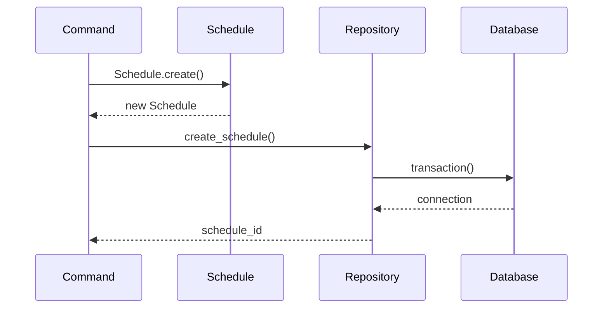
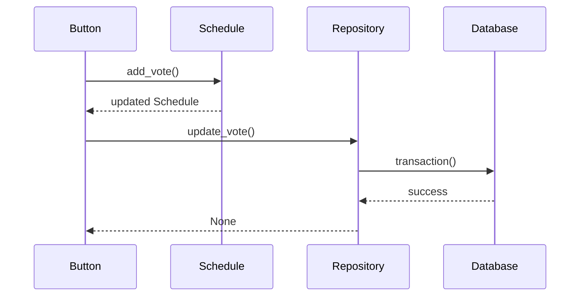
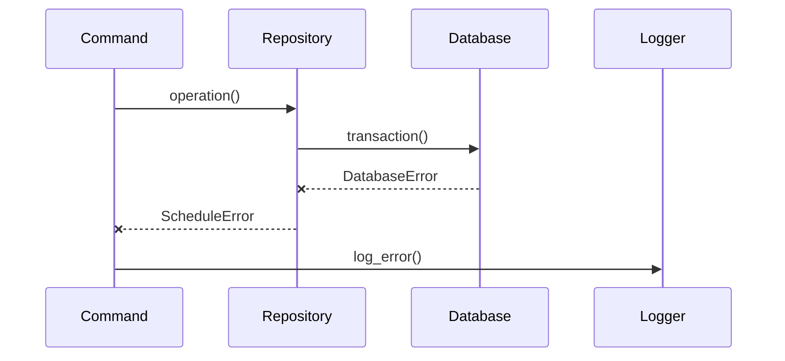

# モジュール設計書

## ディレクトリ構造
```
src/
└── simple_schedule_bot/
    ├── __init__.py
    ├── main.py              # エントリーポイント
    ├── core/               # コア機能
    │   ├── __init__.py
    │   ├── config.py       # 設定管理
    │   ├── logger.py       # ログ管理
    │   └── exceptions.py   # カスタム例外
    │
    ├── models/            # データモデル
    │   ├── __init__.py
    │   └── schedule.py    # スケジュールモデル
    │
    ├── db/               # データベース関連
    │   ├── __init__.py
    │   ├── database.py   # DB管理
    │   └── repository.py # データアクセス
    │
    └── commands/         # コマンド処理
        ├── __init__.py
        └── ping.py      # Pingコマンド
```

## モジュール詳細

### 1. Database Module

#### database.py
```python
class DatabaseManager:
    """データベース接続とトランザクション管理"""
    async def init():
        """DB初期化とテーブル作成"""
    
    @asynccontextmanager
    async def connect():
        """DB接続の管理"""
    
    @asynccontextmanager
    async def transaction():
        """トランザクション管理"""
    
    async def close():
        """接続のクローズ"""
```

#### repository.py
```python
class ScheduleRepository:
    """スケジュールデータのCRUD操作"""
    async def create_schedule(schedule: Schedule) -> str:
        """スケジュール作成"""
    
    async def get_schedule(id: str) -> Optional[Schedule]:
        """スケジュール取得"""
    
    async def update_vote(vote: Vote) -> None:
        """投票の更新"""
    
    async def confirm_schedule(id: str, date: datetime) -> None:
        """スケジュール確定"""
    
    async def cancel_schedule(id: str) -> None:
        """スケジュールキャンセル"""
```

### 2. Models Module

#### schedule.py
```python
class VoteStatus(str, Enum):
    """投票状態の定義"""
    CIRCLE = "⭕"
    TRIANGLE = "🔺"
    CROSS = "❌"

class ScheduleStatus(str, Enum):
    """スケジュール状態の定義"""
    ACTIVE = "active"
    CONFIRMED = "confirmed"
    CANCELLED = "cancelled"

@dataclass
class Vote:
    """投票データモデル"""
    id: Optional[int]
    schedule_id: str
    user_id: int
    date: datetime
    vote_status: VoteStatus
    created_at: datetime

@dataclass
class ScheduleDate:
    """候補日時データモデル"""
    id: Optional[int]
    schedule_id: str
    date: datetime

@dataclass
class Schedule:
    """スケジュールデータモデル"""
    id: str
    title: str
    description: Optional[str]
    creator_id: int
    channel_id: int
    status: ScheduleStatus
    created_at: datetime
    confirmed_date: Optional[datetime]
    reminder_sent: bool
    dates: List[ScheduleDate]
    votes: Dict[int, Dict[datetime, Vote]]
```

### テストカバレッジ
- Schedule: 100%カバレッジ達成
- テストケース:
  - スケジュール作成
  - 投票追加と更新
  - 投票集計
  - スケジュール確定
  - 投票状態の検証
  - スケジュール状態の遷移

## モジュール間のデータフロー

### 1. スケジュール作成フロー


### 2. 投票処理フロー


### 3. スケジュール確定フロー


## エラーハンドリング

### エラーフロー


## 注意事項
1. すべてのデータベース操作は非同期処理
2. トランザクションによるデータ整合性の保証
3. エラーは適切な層で捕捉してログ記録
4. モデルのバリデーションは作成時に実施
