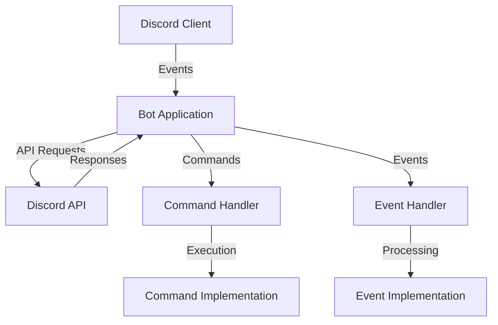

# Discord Botの概要

## Discord Botとは
Discord Botは、Discordサーバー上で自動化されたタスクを実行するプログラムです。ユーザーとのインタラクション、サーバー管理、情報提供など、様々な機能を提供できます。

## できること

### 1. メッセージ処理
- ユーザーのメッセージに反応
- コマンドの実行
- 自動返信
- コンテンツのフィルタリング

### 2. インタラクティブ機能
- ボタンの表示と処理
- ドロップダウンメニュー
- モーダルフォーム
- リアクション処理

### 3. サーバー管理
- メンバー管理
- 権限制御
- チャンネル管理
- ロール管理

### 4. マルチメディア
- 画像や動画の送信
- 音声チャンネルでの音楽再生
- ファイル共有

## 技術スタック

### 必須技術
- Python 3.8以上
- discord.py ライブラリ
- 非同期プログラミングの基礎知識

### 推奨スキル
- REST APIの基本的な理解
- JSON データの取り扱い
- データベース操作（必要に応じて）
- Git によるバージョン管理

## アーキテクチャ概要

## 開発フロー

1. **計画**
   - 機能要件の定義
   - コマンド構造の設計
   - データ構造の設計

2. **セットアップ**
   - 開発環境の構築
   - Botアカウントの作成
   - 基本構造の実装

3. **開発**
   - コマンドの実装
   - イベントハンドラの実装
   - エラー処理の追加
   - テスト

4. **デプロイ**
   - 本番環境の準備
   - Botのデプロイ
   - モニタリングの設定

## 注意点

1. **セキュリティ**
   - トークンの適切な管理
   - 権限の適切な設定
   - 入力値の検証

2. **パフォーマンス**
   - レート制限への対応
   - リソースの効率的な使用
   - キャッシュの適切な管理

3. **メンテナンス**
   - ログの適切な記録
   - エラーの適切な処理
   - コードの保守性維持

## 次のステップ
- [必要条件](02_prerequisites.md)を確認し、開発環境を整える
- [Botのセットアップ](03_bot_setup.md)に進み、最初のBotを作成
